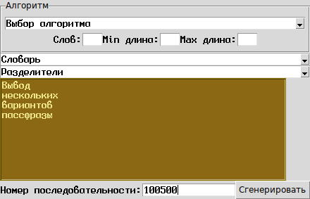

# PasswordGen
Генератор пассфраз и, если хватит времени, паролей

Проектное задание по курсу «[Совместная разработка приложений на Python3](https://uneex.org/LecturesCMC/PythonDevelopment2019)»

Краткая постановка задачи: генератор пассфраз на основании словарей, получаемых из различных мест. Задаётся количество слов в пассфразе, алгоритм составления, максимальный/минимальный размер слов, исходник словаря. Выводится несколько результатов на пробу.

 
[Дизайн интерфейса](doc/setch.ui) в [pygubu](https://github.com/alejandroautalan/pygubu)

Алгоритмов может быть несколько; накоторые из них могут не использваться ловарь, и блок параметров у разных алгоритмов может быть разным.
